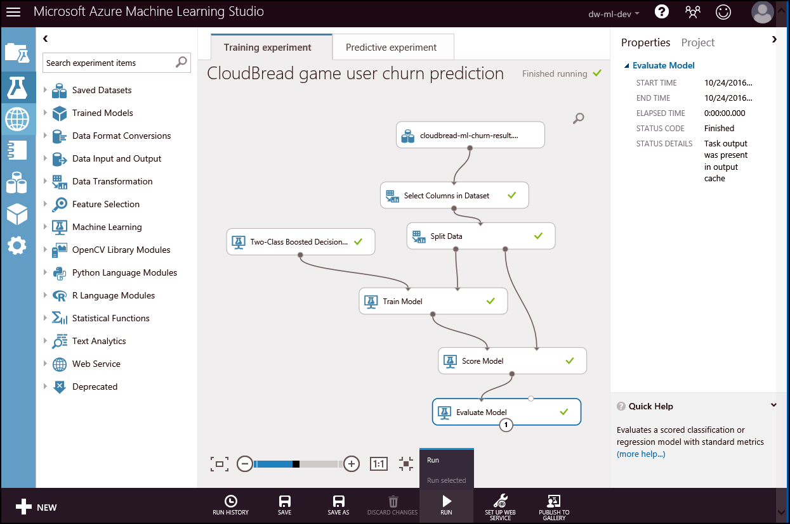
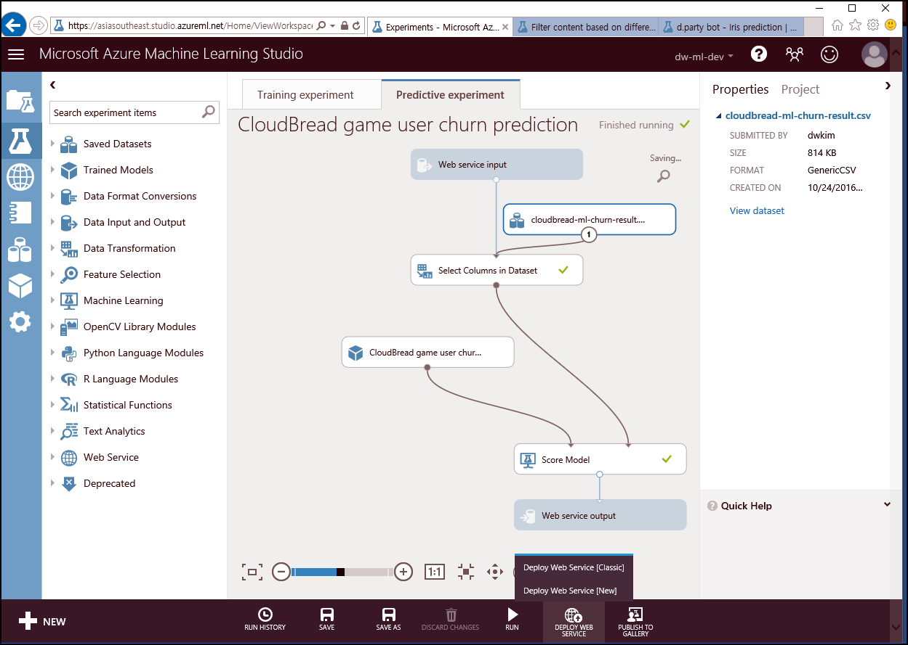
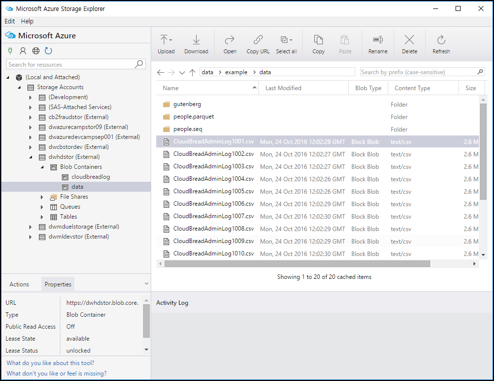
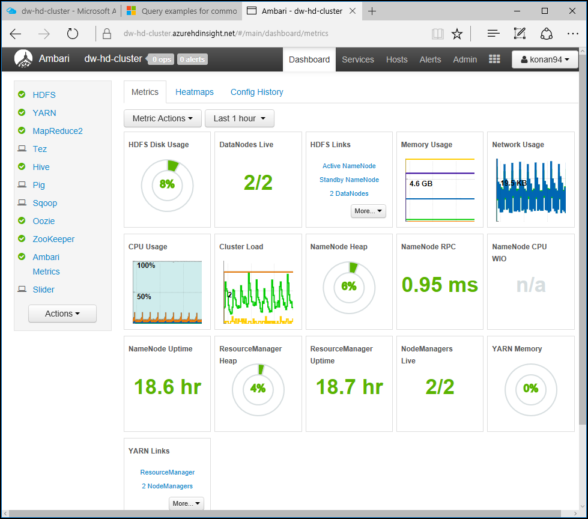

# kaist-cs443
Presentation document for kaist CS443 class - 20161101  
Session subject : Cloud and Machine Learning in real world business  
Short URL : https://aka.ms/cs443  
Download PDF in docs folder  

###Agenda
- Essential – Global cloud service vender(Microsoft, AWS, Google) trend(10 min)  
- Machine Learning & Hadoop in real world business (30 min)  
- Cloud and Machine Learning solution architecture debrief with “code” (30 min)  
- Q&A (10 min)  

###Machine Learning demo
Implement whole workflow - Machine Learning algorithm for predictive analytics 

[Game user churn prediction real-time prediction & Batch prediction](https://gallery.cortanaintelligence.com/Experiment/CloudBread-game-user-churn-prediction-1)  

  

[In-game item suggestion real-time prediction & Batch prediction](https://gallery.cortanaintelligence.com/Experiment/CloudBread-game-item-suggestion-prediction-1)  

###Objective :  
Predict real-time and batch task with shared Machine Learning model  

- Create Machine Learning model or copy gallery model  

-   

- Execute training and check the result  

-   

- Produce Predictive model and publish as "API Web Service"

-   

- Generate service API Key and execute real-time predict with code

    ```
    public class UserChurnController : ApiController  
    {
        // POST api/UserChurn
        public HttpResponseMessage POST(CBChurn p)
        {
            // Machine Learning function request
            InvokeRequestResponseService(p).Wait();
            ...
        }

        // Call Machine Learning Web Service
        static async Task InvokeRequestResponseService(CBChurn p)
        {
            ...
            const string apiKey = "Change-API-Key"; // Replace this with the API key for the web service
            client.DefaultRequestHeaders.Authorization = new AuthenticationHeaderValue("Bearer", apiKey);
            client.BaseAddress = new Uri("Change-Machine-Learning-Web-Service-URL");
            HttpResponseMessage response = await client.PostAsJsonAsync("", scoreRequest).ConfigureAwait(false);
            if (response.IsSuccessStatusCode)
            {
                string result = await response.Content.ReadAsStringAsync();
                Debug.WriteLine("Result: {0}", result);
                p.ChurnYN = result;
            }
            ...
        }
    }
    ```

-   

- Publish Machine Learning API Controller, test in Postman of real-time prediction  

- To execute Batch processing, use Machine Learning Batch execution code  

-   

- In addition, use Azure Functions for server-less batch execution  

-   

Please, reference Postman collection and CloudBread-Machine-Learning source code  


###Hadoop demo
Analyze log data from game server.  
To analyze log data, execute Azure HDInsight - Hadoop distribution of Hortonworks.  

[HDInsight offcial link](https://azure.microsoft.com/en-us/services/hdinsight/)  

With Hadoop, will try **mobile game stage level(diffculty) design**  

###Mobile game stage level design  
- Objective : 30+ game stage casual game. To sustaining on game, will design game difficulty with analytics way. To implement this objective, 7 days of closed beta service with user group and collected game log data from it.  

- To process blob data, [Storage Explorer](http://storageexplorer.com/) and load blob. Map below   *"wasbs:///example/data/"* filder  

- 

- csv file structure  

	PartitionKey|RowKey|Timestamp|Date|Level|Logger|Message
---|---|---|---|---|---|---|
BECA21F0-8B5E-4877-A18A-FD2A4B04322D|4DC0C4A6-893C-4246-AF80-B990EDD10C54|0.011269676|2016-09-10T04:29:50.828Z|stage5|CBComInsMemberGameInfoStages|9
6EDC9E0F-5E7E-4A04-B420-5F3091052CE7|819F7AC7-61E9-40C8-9904-B53B1008311E|0.011269676|2016-06-13T17:40:10.131Z|stage21|CBComInsMemberGameInfoStages|14
9F86454F-4E96-4CAD-A0AE-05DED005774F|766461D9-5FE6-4135-8FB3-15AACE24C4A8|0.011269676|2016-10-18T08:06:05.589Z|stage15|CBComInsMemberGameInfoStages|7
920E72B5-377C-4590-82D5-387ED86EF757|3AB215E0-AAE7-4E69-AF8B-825FADBAF756|0.011269676|2016-06-13T17:38:02.779Z|stage14|CBComInsMemberGameInfoStages|1
	daily 10,000+ log data with "stage clear time" and etc.
    
- Open HDInsigt Cluster Manager and execute Hive query  

-   

- Prepare Hive query  

-   

- Load csv files from Hive as "External Table"  
    ```
    set hive.execution.engine=tez;
    DROP TABLE cloudbreadlog;
    CREATE EXTERNAL TABLE cloudbreadlog (
        PartitionKey string, 
        RowKey string, 
        `Timestamp` string, 
        `Date` string, 
        Level string, 
        Logger string, 
        Message string
    )
    ROW FORMAT DELIMITED FIELDS TERMINATED BY ','
    STORED AS TEXTFILE LOCATION 'wasbs:///example/data/';
    SELECT 
        * 
    FROM 
        cloudbreadlog 
    WHERE 
        INPUT__FILE__NAME LIKE '%.csv' 
    --	where Logger like 'CBComInsMemberGameInfoStages'
    --	AND INPUT__FILE__NAME LIKE '%.csv' 
    --order by level asc;
    ```  
	Execute the Hive query
- Check data w/ Hiave query Hive  
    ```
    SELECT count(*) FROM cloudbreadlog;
    ```

- Fast speed, load table as "Internal Table ORC(Optimized Row Columnar)"
    ```
    set hive.execution.engine=tez;
    CREATE TABLE IF NOT EXISTS CloudBreadStageTime(
        PartitionKey string, 
        RowKey string, 
        `Timestamp` string, 
        `Date` string, 
        Level string, 
        Logger string, 
        Message string
    )
    STORED AS ORC;
    INSERT OVERWRITE TABLE CloudBreadStageTime
    SELECT 
        PartitionKey,
        RowKey, 
        `Timestamp`, 
        `Date`, 
        Level, 
        Logger, 
        Message
    FROM 
        cloudbreadlog;
    ```

- Execute final aggregation query in Hadoop ORC table.
    ```
    select 
        level, 
        avg(cast(Message as int)) as stage_play_avg_min, 
        sum(cast(Message as int)) as stage_play_sum_min 
    from CloudBreadStageTime
    where Logger = 'CBComInsMemberGameInfoStages'
    group by level
    order by level asc;
    ```

- Then, can manipulate reslut Avg. take time of stage  

    level|stage_play_avg_min|stage_play_sum_min
    ---|---|---|
    stage0|7.032447466|22757
    stage1|6.923216995|22812
    stage10|6.990762125|24216
    stage11|6.962710861|23527
    stage12|6.99791294|23471
    stage13|7.04329525|23426
    stage14|7.060240964|24026
    stage15|7.005102041|23341
    stage16|6.991793313|23003
    stage17|6.954984894|23021
    stage18|7.089904421|23737
    stage19|7.13037037|24065
    stage2|7.110673135|23451
    ...

- Data visualization  

Thanks for participating in this class and good luck  